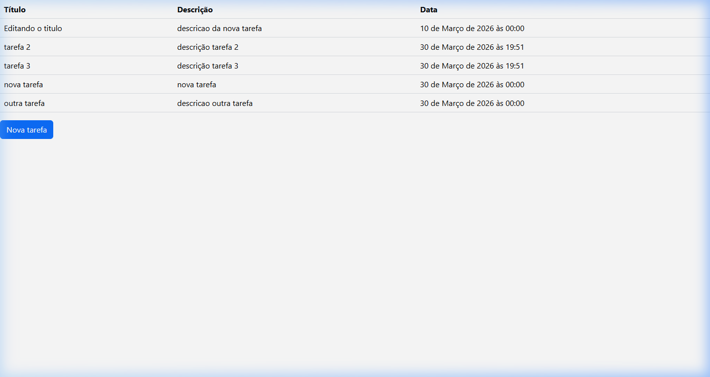

# Projeto Django - Todo List

Este é um projeto simples de lista de tarefas (Todo List) desenvolvido utilizando o framework **Django**, a linguagem de programação **Python** e o banco de dados **SQLite**. A aplicação permite gerenciar, listar e acompanhar facilmente as tarefas.

## Demonstração da Aplicação Rodando

Abaixo está uma imagem real do sistema de listagem das tarefas funcionando localmente:



---

## Guia de Comandos Rápidos (Cheat Sheet)

Aqui estão listados os principais comandos utilizados no ciclo de vida de um projeto em Django. Útil tanto para referência no Linux quanto no Windows:

**1 - Criar ambiente virtual**
```bash
python3 -m venv venv
```

**2 - Ativar ambiente virtual (Linux / macOS)**
```bash
source venv/bin/activate
```

**2.1 - Ativar ambiente virtual (Windows)**
```bash
.\venv\Scripts\activate
```

**3 - Instalar Django**
```bash
pip install django
```
*(Para instalar as versões exatas desse projeto, use `pip install -r requirements.txt`)*

**3.1 - Verificar a instalação do pip e pacotes (Exportar)**
```bash
pip freeze
```

**4 - Criar projeto (do zero)**
```bash
django-admin startproject nome_do_projeto
```

**5 - Rodar o servidor**
*((Lembre-se de estar na mesma pasta do arquivo `manage.py`))*
```bash
python3 manage.py runserver
```

**6 - Mudar a porta do servidor**
```bash
python3 manage.py runserver 8080
```

**7 - Criar aplicação app**
```bash
python3 manage.py startapp nome_do_app
```

**8 - Criação das tabelas no banco de dados e alterações no esquema do bd**
```bash
python3 manage.py migrate
```

**9 - Mudança na estrutura de modelos do app**
```bash
python3 manage.py makemigrations nome_do_app
```

**10 - Comando para verificar problemas no projeto**
```bash
python3 manage.py check
```

**11 - Shell do python (Django)**
```bash
python3 manage.py shell
```

**12 - Comando para criar usuário administrador**
```bash
python3 manage.py createsuperuser
```

**13 - Comando para baixar DB-Browser (No Linux Ubuntu/Debian)**
```bash
sudo apt-get update
sudo apt-get install sqlitebrowser
```

*(Obs: Dependendo de como o Python está instalado no seu Windows, os comandos que começam com `python3` ou `python3 -m` devem ser usados apenas como `python`).*
